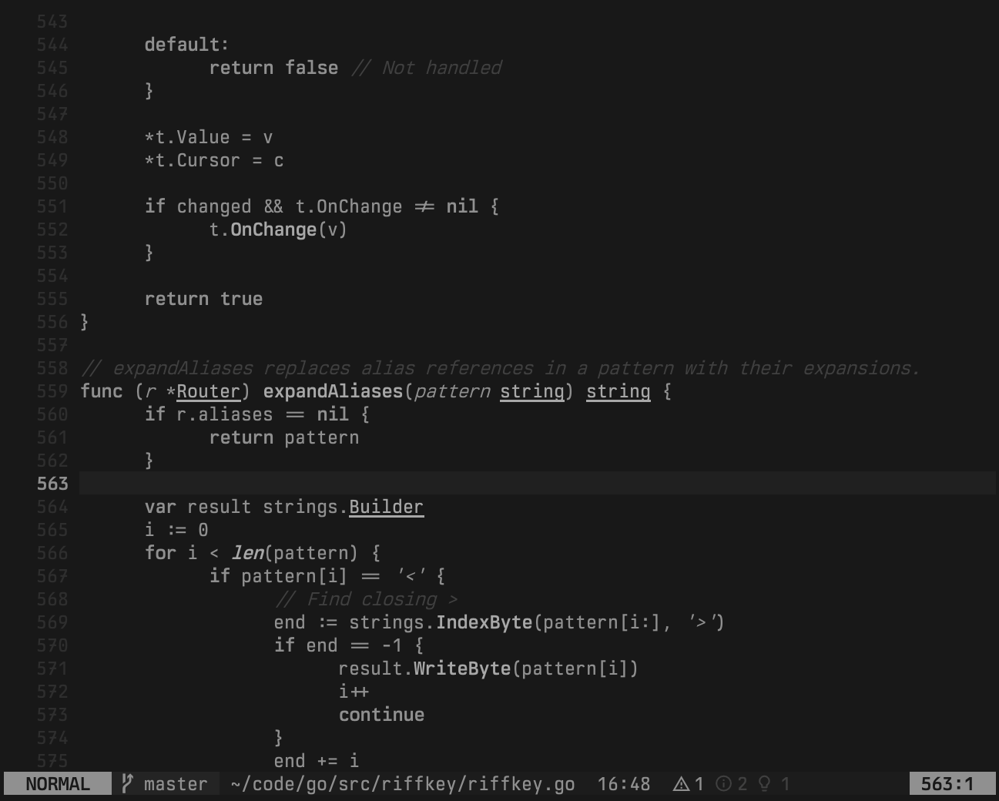
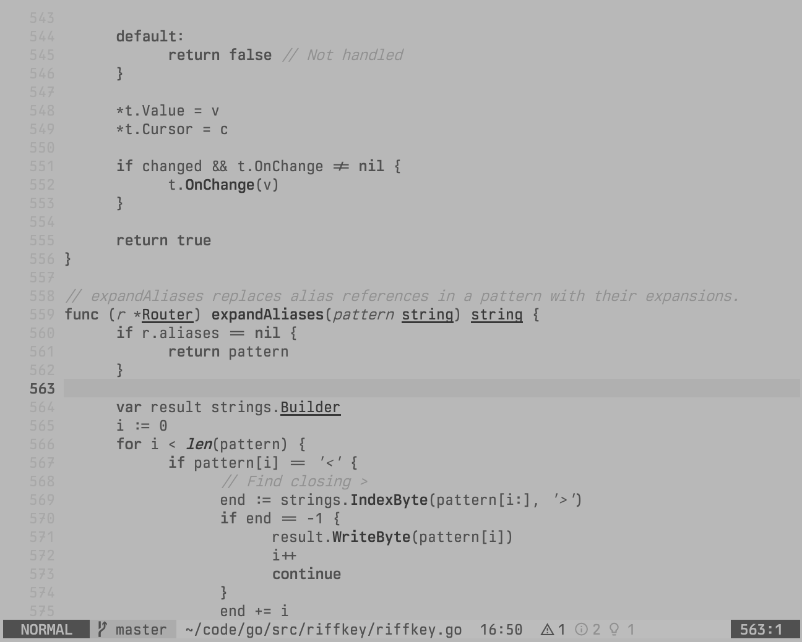
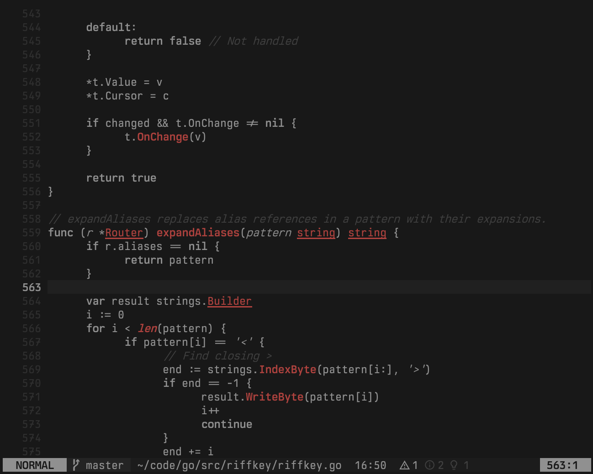
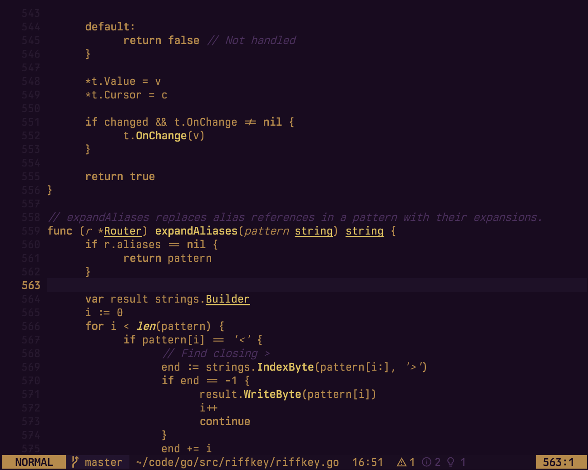

# mfd.nvim

Monotone colorschemes for Neovim. Aesthetic inspiration from [U.S. Graphics Company](https://usgraphics.com) — thanks for the beautiful work.

Fourteen variants, from phosphor CRTs to night vision.

> [!TIP]
> **New:**  
> `mfd-flir` 4 new thermal display schemes.  
> `mfd-blackout` true black, ultra-low contrast for late night use.  
> `bright_comments` option increases comment visibility for all themes.


## Themes

### MFD / MFD-DARK
Olive sage.


### MFD-STEALTH
Green phosphor.


### MFD-AMBER
Amber phosphor.


### MFD-MONO
White phosphor.


### MFD-SCARLET
Deep red.


### MFD-PAPER
High contrast terminal.


### MFD-HUD
Heads-up display.


### MFD-NVG
Night vision goggles.


### MFD-BLACKOUT
Covert lighting conditions.


### MFD-FLIR
White-hot thermal.



### MFD-FLIR-BH
Black-hot thermal.



### MFD-FLIR-RH
Red-hot thermal.



### MFD-FLIR-FUSION
Thermal fusion.



## Installation

```lua
-- lazy.nvim
{
  'kungfusheep/mfd.nvim',
  lazy = false,
  priority = 1000,
  config = function()
    vim.cmd('colorscheme mfd-stealth')
  end,
}
```

## Approach

Syntax differentiation through text decoration, not colour:

- **Bold** — keywords, functions
- *Italic* — strings, comments, parameters
- <ins>Underline</ins> — types, structures

Lualine themes are included for each variant.

## Cursor sync

Each theme defines per-mode cursor highlights (`CursorNormal`, `CursorInsert`, `CursorVisual`, `CursorReplace`, `CursorCommand`). To sync these to your terminal cursor via OSC 12 (works with Ghostty, kitty, etc.):

```lua
{
  'kungfusheep/mfd.nvim',
  lazy = false,
  priority = 1000,
  config = function()
    vim.cmd('colorscheme mfd-stealth')

    vim.opt.guicursor = {
      "n:block-CursorNormal",
      "v:block-CursorVisual",
      "i:block-CursorInsert",
      "r-cr:block-CursorReplace",
      "c:block-CursorCommand",
    }

    require('mfd').enable_cursor_sync()
  end,
}
```

## Options

Call `setup()` before setting the colorscheme:

```lua
require('mfd').setup({
  bright_comments = true, -- increase comment visibility (default: false)
})
```

## License

Apache 2.0 [LICENSE](LICENSE)


