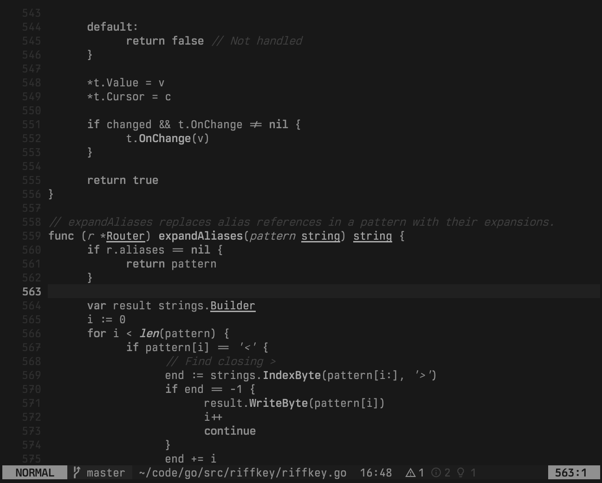
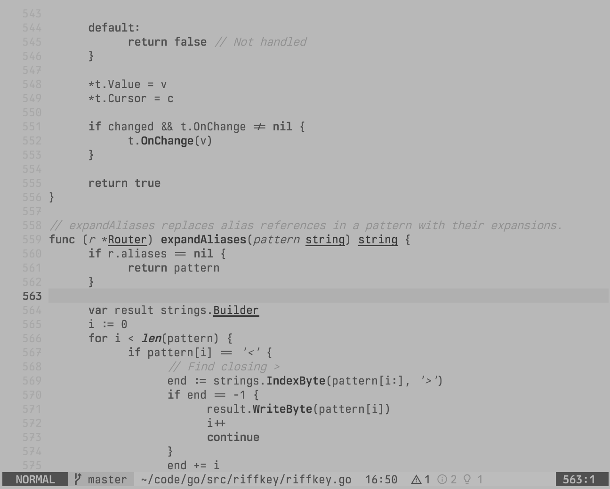
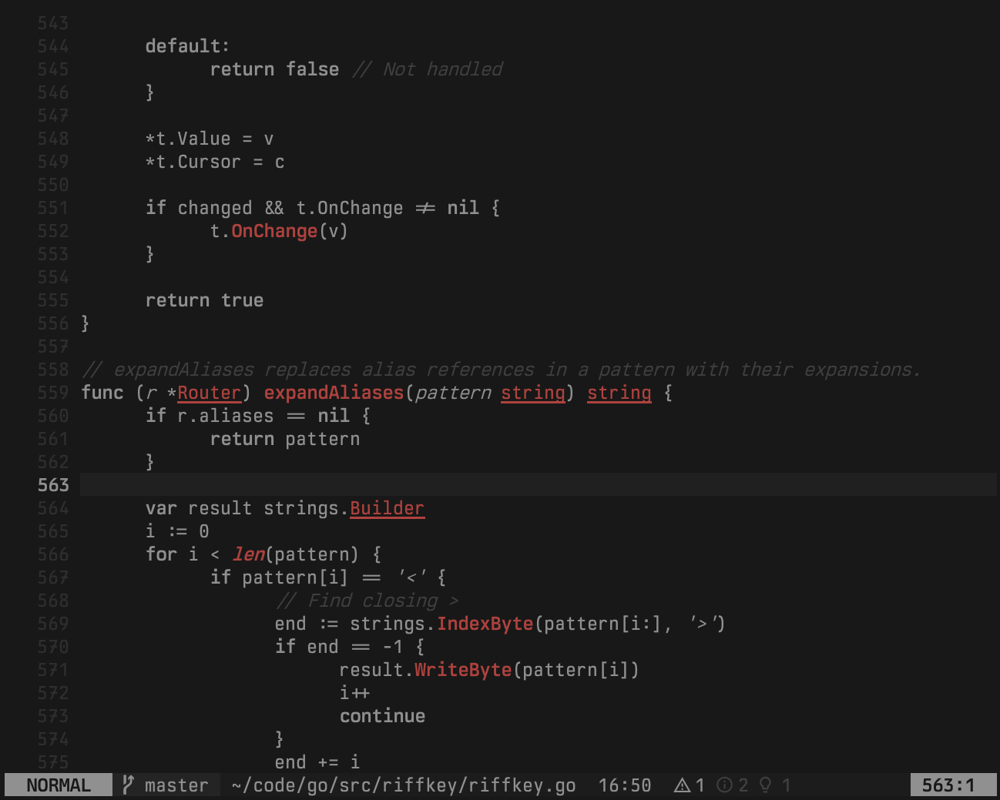
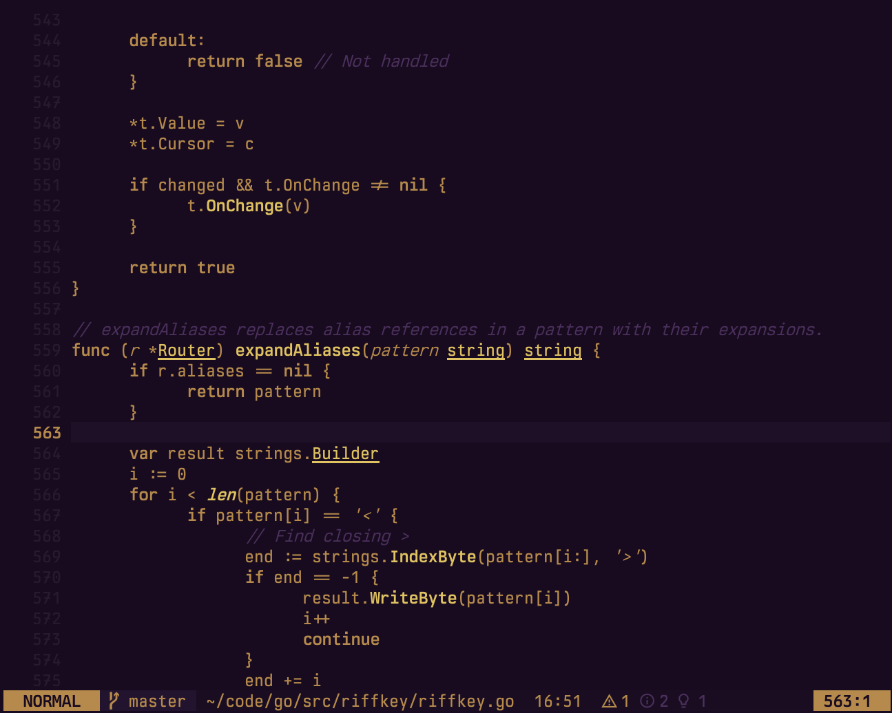
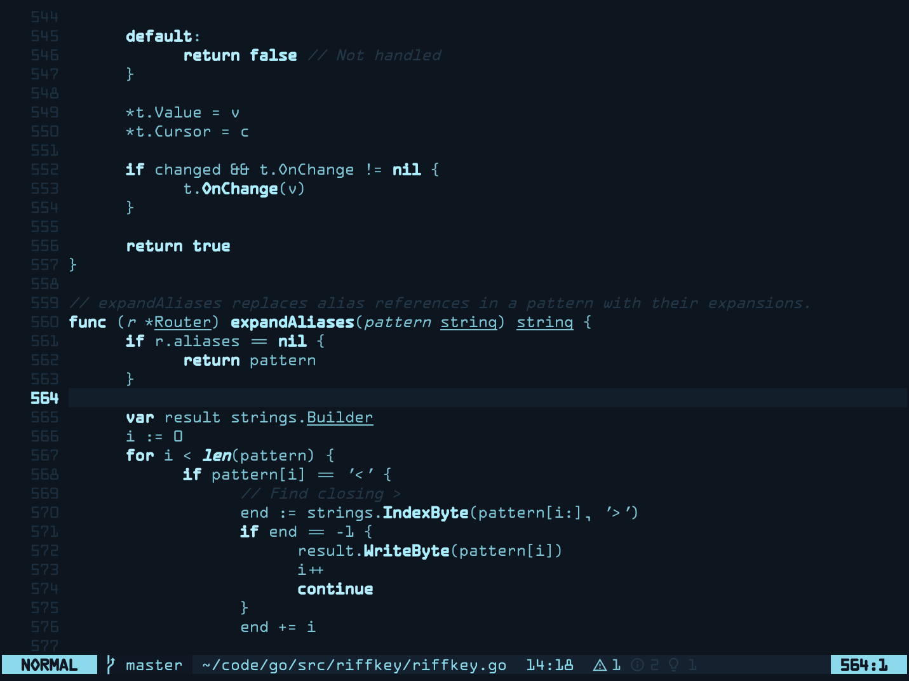
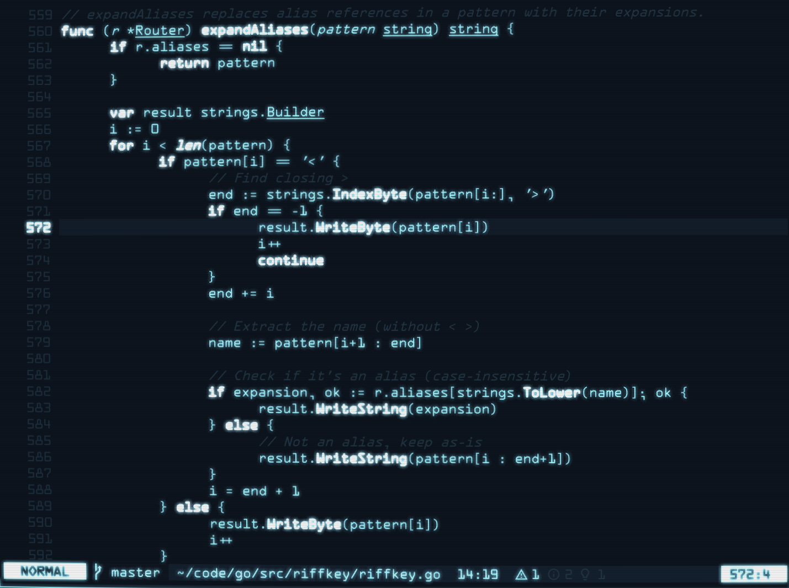
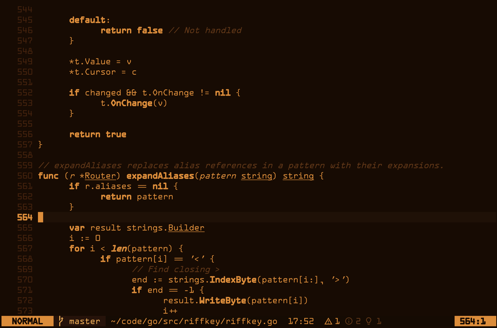

# mfd.nvim

Monotone colorschemes for Neovim. Eighteen variants, from phosphor CRTs to night vision display technologies. Inspired by the aesthetics of military MFDs (multi-function displays) and vintage computer terminals.

> [!TIP]  
> **New:**  
> [`mfd-nerv`](#mfd-nerv) Evangelion NERV terminal — Warm orange phosphor + bleed.  
> `accessibility_contrast` slider (0–10) for [WCAG-compliant contrast](#accessibility).  
> [`mfd-lumon`](#mfd-lumon) Lumon Industries MDR terminal with CRT phosphor glow.  
> `mfd-gbl` Game Boy Light electroluminescence, dark and light variants.  
> `mfd-flir` 4 thermal display schemes.  
> `mfd-blackout` true black, ultra-low contrast for late night use.  


## Themes

### MFD / MFD-DARK
Olive sage.


### MFD-STEALTH
Green phosphor.


### MFD-AMBER
Amber phosphor.


### MFD-MONO
White phosphor.


### MFD-SCARLET
Deep red.


### MFD-PAPER
High contrast terminal. Aesthetic inspiration from [U.S. Graphics Company](https://usgraphics.com) - thanks for the beautiful work.


### MFD-HUD
Heads-up display.


### MFD-NVG
Night vision goggles.


### MFD-BLACKOUT
Covert lighting conditions.


### MFD-FLIR
White-hot thermal.



### MFD-FLIR-BH
Black-hot thermal.



### MFD-FLIR-RH
Red-hot thermal.



### MFD-FLIR-FUSION
Thermal fusion.



### MFD-GBL-LIGHT
Game Boy Light electroluminescence.


### MFD-GBL-DARK
Game Boy Light electroluminescence.


### MFD-LUMON
Lumon Industries Macrodata Refinement terminal.


(with a ghostty CRT shader)


### MFD-NERV
Evangelion NERV HQ terminal display. Hot orange phosphor with warm bleed.




## Installation

```lua
-- lazy.nvim
{
  'kungfusheep/mfd.nvim',
  lazy = false,
  priority = 1000,
  config = function()
    vim.cmd('colorscheme mfd-stealth')
  end,
}
```

## Approach

Syntax differentiation through text decoration, not colour:

- **Bold** — keywords, functions
- *Italic* — strings, comments, parameters
- <ins>Underline</ins> — types, structures

Lualine themes are included for each variant.

## Cursor sync

Each theme defines per-mode cursor highlights (`CursorNormal`, `CursorInsert`, `CursorVisual`, `CursorReplace`, `CursorCommand`). To sync these to your terminal cursor via OSC 12 (works with Ghostty, kitty, etc.):

```lua
{
  'kungfusheep/mfd.nvim',
  lazy = false,
  priority = 1000,
  config = function()
    vim.cmd('colorscheme mfd-stealth')

    vim.opt.guicursor = {
      "n:block-CursorNormal",
      "v:block-CursorVisual",
      "i:block-CursorInsert",
      "r-cr:block-CursorReplace",
      "c:block-CursorCommand",
    }

    require('mfd').enable_cursor_sync()
  end,
}
```

## Options

Call `setup()` before setting the colorscheme:

```lua
require('mfd').setup({
  accessibility_contrast = 0, -- 0 (default) to 10 (max WCAG compliance)
  no_italic = true,           -- disable italic highlighting (default: false)
  bright_comments = true,     -- legacy: equivalent to accessibility_contrast = 4
})
```

## Accessibility

`accessibility_contrast` lifts dim elements (comments, line numbers, inlay hints, borders) toward WCAG compliance while preserving each theme's hue.

Even small values make a noticeable difference. You'll likely find a comfortable level well before reaching formal WCAG thresholds. Your environment brightness matters too; a theme like mfd-blackout is perfectly readable in a dark room but benefits from a higher level in daylight.

| Theme | Level 5 | Level 10 |
|---|---|---|
| mfd | 1.5 | AA-UI (3.01) |
| mfd-dark | AA-UI | AAA |
| mfd-stealth | AA-UI | AAA |
| mfd-amber | AA-UI | AAA |
| mfd-mono | AA-UI | AAA |
| mfd-scarlet | 2.7 | AAA |
| mfd-paper | 2.6 | AAA |
| mfd-hud | AA-UI | AAA |
| mfd-nvg | AA-UI | AAA |
| mfd-gbl-light | AA-UI | AAA |
| mfd-gbl-dark | AA-UI | AAA |
| mfd-lumon | AA-UI | AAA |
| mfd-nerv | AA-UI | AAA |
| mfd-flir | 2.8 | AAA |
| mfd-flir-bh | 2.6 | AAA |
| mfd-flir-rh | 2.8 | AAA |
| mfd-flir-fusion | 2.6 | AA (6.56) |
| mfd-blackout | 2.6 | AAA |

AA-UI ≥ 3.0 / AA ≥ 4.5 / AAA ≥ 7.0

## License

Apache 2.0 [LICENSE](LICENSE)


